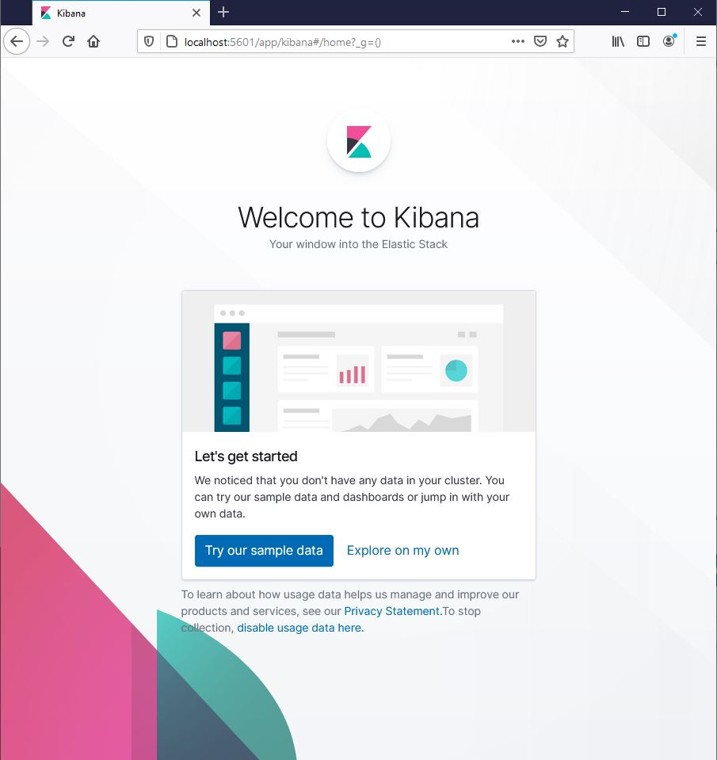

### ElasticSearch + Kibana

Para iniciar los servicios ejecutamos el comando:

     docker-compose up -d

para validar que los servicios estan corriendo correctamente, por medio del navegador consultamos las siguientes url:

     http://localhost:9200

	 http://locahost:5601

     

 

Los servicios estan listos para ser usados.
